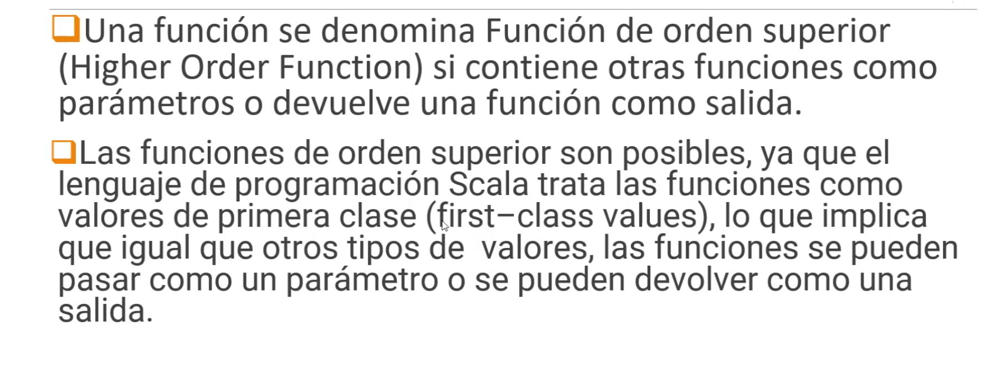

# 7-programacion-funcional

1. [High Order Functions](#schema1)
2. [Funciones anónimas. Functions Literals](#schema2)
3. [Funciones como parametros](#schema3)
4. [Funciones como Variables](#schema4)
5. [Paso a Paso para Devolver una Función](#schema5)
6. [Partially Applied Functions](#schema6)
7. [Currying Functions](#schema7)
8. [Closures](#schema8)

<hr>

<a name="schema1"></a>

## 1. High Order Functions



Esto proporciona una manera flexible de componer programas.


<hr>

<a name="schema2"></a>

## 2. Funciones anónimas. Functions Literals

En Scala, las funciones anónimas, también conocidas como funciones lambda o literales de función, son funciones que no tienen nombre y se definen en el lugar donde se utilizan. Estas funciones son útiles para operaciones rápidas y sencillas, como pasar una función como argumento a otro método o trabajar con colecciones.

### **Sintaxis Básica**
La sintaxis básica de una función anónima es:

```scala
(valores_de_entrada) => cuerpo_de_la_función
```
### **Ejemplos de Uso**
1. Función Anónima Básica
```scala
val suma = (a: Int, b: Int) => a + b
println(suma(3, 4))  // Output: 7
```
2. Usando Funciones Anónimas con Colecciones
Las funciones anónimas son frecuentemente utilizadas con métodos de colecciones como map, filter, y reduce.

```scala
val numeros = List(1, 2, 3, 4, 5)

// Usando una función anónima con map
val cuadrados = numeros.map(x => x * x)
println(cuadrados)  // Output: List(1, 4, 9, 16, 25)

// Usando una función anónima con filter
val pares = numeros.filter(x => x % 2 == 0)
println(pares)  // Output: List(2, 4)

// Usando una función anónima con reduce
val sumaTotal = numeros.reduce((a, b) => a + b)
println(sumaTotal)  // Output: 15
```
### **Sintaxis Abreviada**
Scala permite una sintaxis abreviada para funciones anónimas, especialmente útil con colecciones. Si el tipo de los parámetros puede ser inferido, no es necesario declararlos explícitamente.

```scala
val cuadrados = numeros.map(_ * _)
println(cuadrados)  // Output: List(1, 4, 9, 16, 25)
```
### **Funciones Literales**
Una función literal es simplemente una función anónima que se puede pasar como argumento o asignar a una variable. En realidad, la función anónima y el literal de función son la misma cosa en Scala.

```scala
val multiplicarPorDos = (x: Int) => x * 2
println(multiplicarPorDos(5))  // Output: 10
```
### **Funciones de Orden Superior**
Las funciones de orden superior son funciones que toman otras funciones como argumentos o devuelven funciones como resultado. Esto es muy poderoso para crear abstracciones y reducir el código repetitivo.

```scala
def aplicarOperacion(a: Int, b: Int, operacion: (Int, Int) => Int): Int = {
  operacion(a, b)
}

val suma = (a: Int, b: Int) => a + b
val resta = (a: Int, b: Int) => a - b

println(aplicarOperacion(5, 3, suma))  // Output: 8
println(aplicarOperacion(5, 3, resta))  // Output: 2
```
### **Ventajas de las Funciones Anónimas**
1. Concisas: Eliminan la necesidad de definir funciones explícitas por separado, lo que hace el código más corto y claro.
2. Flexibles: Pueden ser usadas en cualquier lugar donde se necesite una función, sin la necesidad de asignar un nombre.
3. Expresivas: Permiten escribir expresiones funcionales complejas de manera más natural.
### **Resumen**
- Funciones Anónimas: Son funciones sin nombre que se definen en el lugar donde se necesitan.
- Sintaxis: (parametros) => cuerpo.
- Uso Común: Métodos de colecciones (map, filter, reduce) y funciones de orden superior.
- Ventajas: Código más conciso, flexible y expresivo.

Las funciones anónimas son una característica poderosa en Scala, que permiten un estilo de programación funcional más limpio y directo.

<hr>

<a name="schema3"></a>


## 3.Funciones como parametros

En Scala, las funciones pueden ser pasadas como argumentos a otros métodos y funciones. Esto es una característica fundamental en la programación funcional y permite escribir código más modular, reutilizable y flexible.

### **Definición de Funciones que Aceptan Otras Funciones como Parámetros**
Para definir una función que acepta otra función como parámetro, se especifica el tipo del parámetro como una función. La notación para el tipo de una función es `(TipoEntrada) => TipoSalida.`

### Ejemplo Básico
Supongamos que queremos definir una función que aplica una operación a dos números enteros:

```scala
def aplicarOperacion(a: Int, b: Int, operacion: (Int, Int) => Int): Int = {
  operacion(a, b)
}
```
### **Uso de la Función con Diferentes Operaciones**
Podemos definir diferentes operaciones como funciones anónimas y pasarlas a `aplicarOperacion`.

```scala
val suma = (a: Int, b: Int) => a + b
val resta = (a: Int, b: Int) => a - b

println(aplicarOperacion(5, 3, suma))  // Output: 8
println(aplicarOperacion(5, 3, resta))  // Output: 2
```
También se pueden usar funciones definidas anteriormente:

```scala
def multiplicar(a: Int, b: Int): Int = a * b
println(aplicarOperacion(5, 3, multiplicar))  // Output: 15
```
### **Ejemplo con Colecciones**
Las colecciones en Scala tienen varios métodos que aceptan funciones como parámetros. Por ejemplo, `map, filter, y reduce` son métodos que aceptan funciones como parámetros.

```scala
val numeros = List(1, 2, 3, 4, 5)

// Usando una función anónima con map
val cuadrados = numeros.map(x => x * x)
println(cuadrados)  // Output: List(1, 4, 9, 16, 25)

// Usando una función anónima con filter
val pares = numeros.filter(x => x % 2 == 0)
println(pares)  // Output: List(2, 4)

// Usando una función anónima con reduce
val sumaTotal = numeros.reduce((a, b) => a + b)
println(sumaTotal)  // Output: 15
```
### **Ventajas de Pasar Funciones como Parámetros**
1. Reutilización de Código: Puedes escribir funciones generales que se comportan de manera diferente según las funciones que se les pasan.
2. Modularidad: Permite dividir el código en componentes más pequeños y manejables.
3. Flexibilidad: Facilita la implementación de lógica compleja de manera simple y expresiva.
### **Ejemplo Complejo**
Supongamos que queremos definir una función que procesa una lista de números y permite aplicar diferentes transformaciones y filtros:

```scala
def procesarLista(
  lista: List[Int], 
  transformar: Int => Int, 
  filtro: Int => Boolean
): List[Int] = {
  lista.filter(filtro).map(transformar)
}

val numeros = List(1, 2, 3, 4, 5)

val transformacion = (x: Int) => x * 2
val condicion = (x: Int) => x % 2 == 0

val resultado = procesarLista(numeros, transformacion, condicion)
println(resultado)  // Output: List(4, 8)
```
### **Resumen**
- Funciones como Parámetros: Permiten pasar funciones como argumentos a otras funciones.
- Sintaxis: `(TipoEntrada) => TipoSalida` para definir el tipo de una función.
- Ventajas: Reutilización de código, modularidad, y flexibilidad.
- Ejemplos Comunes: Métodos de colecciones (map, filter, reduce).

<hr>

<a name="schema4"></a>


## 4. Funciones como Variables
Aquí hay un resumen y ejemplos sobre cómo trabajar con funciones como variables en Scala:

### **Definición de Funciones como Variables**
Puedes definir una función y asignarla a una variable de manera similar a cómo lo harías con cualquier otro tipo de valor.

```scala
// Definir una función y asignarla a una variable
val suma = (a: Int, b: Int) => a + b

// Usar la función
println(suma(3, 4))  // Output: 7
```
### **Pasar Funciones como Parámetros**
Puedes pasar estas variables de función como argumentos a otras funciones.

```scala
def aplicarOperacion(a: Int, b: Int, operacion: (Int, Int) => Int): Int = {
  operacion(a, b)
}

val resta = (a: Int, b: Int) => a - b

println(aplicarOperacion(10, 5, suma))  // Output: 15
println(aplicarOperacion(10, 5, resta))  // Output: 5
```
### **Devolver Funciones desde Funciones**
También puedes devolver funciones desde otras funciones.

```scala
def obtenerOperacion(operacion: String): (Int, Int) => Int = {
  operacion match {
    case "suma" => (a: Int, b: Int) => a + b
    case "resta" => (a: Int, b: Int) => a - b
    case _ => (a: Int, b: Int) => 0
  }
}

val opSuma = obtenerOperacion("suma")
println(opSuma(5, 3))  // Output: 8

val opResta = obtenerOperacion("resta")
println(opResta(5, 3))  // Output: 2
```
### **Ejemplo Completo**
Aquí tienes un ejemplo completo que muestra cómo definir, pasar y devolver funciones como variables.

[Ejemplo completo](./fun-var/)

### **Ventajas**
- Flexibilidad: Puedes cambiar el comportamiento de tu código dinámicamente pasando diferentes funciones.
- Reutilización de Código: Puedes crear funciones genéricas que realicen operaciones variadas dependiendo de las funciones que se les pasen.
- Composición de Funciones: Puedes combinar funciones de formas poderosas y expresivas, facilitando la creación de flujos de procesamiento de datos complejos.

<hr>

<a name="schema5"></a>


## 5. Paso a Paso para Devolver una Función
1. Declarar la Función que Va a Devolver Otra Función:

    - Especifica el tipo de retorno como una función.
    - El tipo de retorno debe seguir la sintaxis (TipoArgumento1, TipoArgumento2, ...) => TipoRetorno.
2. Implementar la Función de Retorno:

    * Dentro de la función principal, define y retorna una función anónima que cumple con el tipo de retorno especificado.
### Ejemplos
#### Ejemplo 1: Función Sencilla
Supongamos que queremos devolver una función que suma dos números:

```scala
def obtenerSuma(): (Int, Int) => Int = {
  (a: Int, b: Int) => a + b
}

val suma = obtenerSuma()
println(suma(3, 4))  // Output: 7
```
#### Ejemplo 2: Función Basada en Parámetro
En este ejemplo, devolvemos una función diferente basada en un parámetro:

```scala
def obtenerOperacion(operacion: String): (Int, Int) => Int = {
  operacion match {
    case "suma" => (a: Int, b: Int) => a + b
    case "resta" => (a: Int, b: Int) => a - b
    case _ => (a: Int, b: Int) => 0
  }
}

val suma = obtenerOperacion("suma")
println(suma(10, 5))  // Output: 15

val resta = obtenerOperacion("resta")
println(resta(10, 5))  // Output: 5

val desconocida = obtenerOperacion("desconocida")
println(desconocida(10, 5))  // Output: 0
```
#### Ejemplo 3: Función con Configuración
Devolvemos una función que utiliza una configuración dada:

```scala
def crearSaludo(saludo: String): String => String = {
  (nombre: String) => s"$saludo, $nombre!"
}

val saludoFormal = crearSaludo("Buenos días")
println(saludoFormal("Patricia"))  // Output: Buenos días, Patricia!

val saludoInformal = crearSaludo("Hola")
println(saludoInformal("Patricia"))  // Output: Hola, Patricia!
```
### **Explicación de los Ejemplos**
1. Declaración del Tipo de Retorno:

    - En cada función principal (obtenerSuma, obtenerOperacion, crearSaludo), el tipo de retorno es una función especificada en el formato (TipoArgumento) => TipoRetorno.
2. Definición y Retorno de Función Anónima:

    - Se define una función anónima dentro de la función principal utilizando la sintaxis (argumentos) => expresión.
    - Esta función anónima se retorna como resultado de la función principal.
### **Ventajas de Devolver Funciones**
- Mayor Abstracción: Permite crear funciones de orden superior que pueden manipular otras funciones, aumentando el nivel de abstracción.
- Modularidad: Facilita la creación de componentes modulares y reutilizables.
- Flexibilidad: Permite cambiar el comportamiento del código dinámicamente pasando diferentes funciones.

<hr>

<a name="schema6"></a>


## 6. Partially Applied Functions

## Funciones Parcialmente Aplicadas en Scala

Las funciones parcialmente aplicadas permiten crear una nueva función a partir de una función existente al fijar algunos de sus argumentos.

### Concepto Básico

- **Función Parcialmente Aplicada**: Función donde algunos argumentos están fijados, pero no todos.

### Ejemplos

#### Ejemplo 1: Función de Suma

```scala
def suma(a: Int, b: Int, c: Int): Int = a + b + c

val sumaParcial = suma(1, _: Int, _: Int)
println(sumaParcial(2, 3))  // Output: 6
```
En este ejemplo:

- La función `suma` toma tres argumentos `a, b y c`.
- La función `sumaParcial` fija el valor de `a` en 1, y deja los otros dos argumentos `(b y c)` sin fijar.
- sumaParcial es una nueva función que toma dos argumentos, los cuales serán utilizados como `b y c` en la llamada a suma.

### Ejemplo 2: Función de Formato de String
```scala
def formatear(pre: String, valor: Double, post: String): String = s"$pre$valor$post"

val formatearConDolar = formatear("$", _: Double, " USD")
println(formatearConDolar(100.0))  // Output: $100.0 USD
```
En este ejemplo:

- La función formatear toma tres argumentos: pre, valor, y post.
- La función formatearConDolar fija el valor de pre en "$" y post en " USD", dejando valor sin fijar.
- formatearConDolar es una nueva función que toma un argumento, que será utilizado como valor en la llamada a formatear.
### **Ventajas de las Funciones Parcialmente Aplicadas**
1. Reutilización de Código: Puedes reutilizar funciones generales para crear funciones más específicas sin duplicar el código.
2. Simplificación de Llamadas: Puedes simplificar las llamadas a funciones complejas al fijar algunos de los argumentos de antemano.
3. Claridad y Legibilidad: Al crear funciones más específicas, el código puede volverse más claro y legible.
### **Funciones Parcialmente Aplicadas con Métodos**
También puedes crear funciones parcialmente aplicadas a partir de métodos:

```scala
object MathUtils {
  def multiplicar(a: Int, b: Int): Int = a * b
}

val multiplicarPorDos = MathUtils.multiplicar(2, _: Int)
println(multiplicarPorDos(5))  // Output: 10
```
En este ejemplo:

- `multiplicar` es un método dentro del objeto `MathUtils`.
- `multiplicarPorDos` es una función parcialmente aplicada que fija el valor de a en 2, y deja b sin fijar.
- `multiplicarPorDos` es una nueva función que toma un argumento, que será utilizado como b en la llamada a `multiplicar`.


<hr>

<a name="schema7"></a>


## 7. Currying Functions

El currying es un concepto fundamental en programación funcional, y Scala lo soporta de manera nativa. Consiste en transformar una función que toma múltiples argumentos en una secuencia de funciones que toman un solo argumento cada una. En otras palabras, una función curried descompone la lista de argumentos en varias funciones que toman un solo argumento y devuelven otra función que toma el siguiente argumento, y así sucesivamente, hasta que todos los argumentos han sido proporcionados.

### **Concepto Básico**
El currying permite que una función que acepta múltiples parámetros se convierta en una serie de funciones anidadas, cada una de las cuales acepta un solo parámetro. Esto se puede hacer manualmente o usando la sintaxis proporcionada por Scala.

### **Ejemplos de Currying**
#### Ejemplo 1: Suma de Dos Números
```scala
def suma(a: Int)(b: Int): Int = a + b

val sumaCurried = suma(1) _
println(sumaCurried(2))  // Output: 3
```
En este ejemplo:

- `suma` es una función curried que toma dos parámetros, a y b, en listas de parámetros separadas.
- `sumaCurried` es una función que toma el primer argumento a y devuelve otra función que toma el segundo argumento b.
#### Ejemplo 2: Función de Multiplicación
```scala
def multiplicar(a: Int)(b: Int): Int = a * b

val doble = multiplicar(2) _
println(doble(5))  // Output: 10
```
En este ejemplo:

- `multiplicar` es una función curried que toma dos parámetros, a y b, en listas de parámetros separadas.
- `doble` es una función que fija a en 2 y devuelve otra función que toma b y multiplica b por 2.
### **Currying con Métodos Normales**
Puedes convertir una función normal en una función curried utilizando el método `curried` en Scala.

```scala
def sumaNormal(a: Int, b: Int): Int = a + b

val sumaCurried = (sumaNormal _).curried
println(sumaCurried(1)(2))  // Output: 3
```
En este ejemplo:

- `sumaNormal` es una función que toma dos argumentos en una sola lista de parámetros.
- `(sumaNormal _).curried` convierte `sumaNormal` en una función curried que toma los argumentos en listas separadas.
### **Ventajas del Currying**
1. Reutilización de Código: Puedes crear funciones más específicas a partir de funciones más generales.
2. Composición de Funciones: Facilita la composición de funciones, ya que puedes aplicar parcialmente los argumentos y combinar funciones.
3. Modularidad y Legibilidad: Mejora la modularidad y legibilidad del código al descomponer funciones complejas en funciones más pequeñas y manejables.
### **Uso en Programación Funcional**
El currying es una técnica común en programación funcional y es ampliamente utilizada en combinaciones de funciones y programación orientada a expresiones.


<hr>

<a name="schema8"></a>

## 8. Closures


Un `closure` es una función que captura las variables libres de su entorno en el momento en que se define. En otras palabras, una función que "recuerda" el contexto en el que fue creada. Esto incluye las variables y constantes que estaban en el alcance cuando se definió la función, incluso si se ejecuta en un contexto diferente más tarde.

### **Concepto Básico de un Closure**
Un closure es una combinación de una función y el entorno léxico en el cual fue declarada. Este entorno consiste en cualquier variable local que estaba en el alcance en el momento en que el closure fue creado.

### **Ejemplo de un Closure en Scala**
```scala
def createAdder(x: Int): Int => Int = {
  def adder(y: Int): Int = x + y
  adder
}

val addFive = createAdder(5)
println(addFive(10))  // Output: 15
```
En este ejemplo:

- `createAdder` es una función que toma un entero `x` y devuelve una función `adder` que toma otro entero y y devuelve la suma de `x` y `y`.
- `adder` es un closure porque captura la variable `x` del entorno donde fue definida.
- `addFive` es una instancia del closure donde `x` es 5, y cuando se llama con 10, devuelve 15.
### **Características de un Closure**
1. Captura de Variables: Puede capturar variables que no son parámetros de la función.
2. Persistencia del Estado: Mantiene el estado de las variables capturadas incluso después de que el entorno en el que fue definido haya desaparecido.
3. Flexibilidad: Permite la creación de funciones más dinámicas y modulares.
### **Ejemplo Adicional: Contador**
```scala
def makeCounter(): () => Int = {
  var count = 0
  () => {
    count += 1
    count
  }
}

val counter1 = makeCounter()
println(counter1())  // Output: 1
println(counter1())  // Output: 2

val counter2 = makeCounter()
println(counter2())  // Output: 1
```
En este ejemplo:

- makeCounter es una función que devuelve una función anónima (closure).
- La función anónima captura la variable count.
- Cada vez que se llama a counter1, incrementa count y devuelve el nuevo valor.
- counter2 es una nueva instancia del closure con su propio count separado.
### **Uso de Closures**
- Funciones de Orden Superior: Utilizados ampliamente en funciones que devuelven otras funciones o toman funciones como parámetros.
- Programación Funcional: Facilitan la programación funcional al permitir la creación de funciones con estado.
- Encapsulamiento: Ayudan a encapsular el estado sin necesidad de usar clases y objetos.
### **Ventajas de los Closures**
1. Encapsulamiento de Estado: Permiten encapsular el estado de una manera elegante y mantenerlo privado.
2. Reutilización de Código: Fomentan la reutilización y composición de funciones.
3. Flexibilidad: Aumentan la flexibilidad del código al permitir la creación dinámica de funciones.